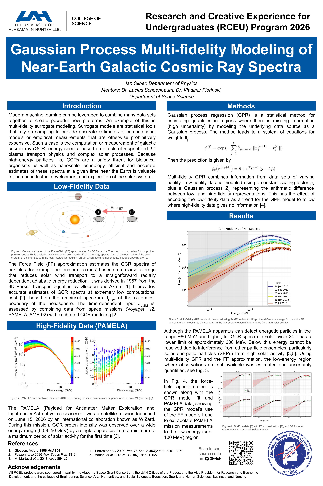

<details>
  <summary>🔍 Click here to view the poster presented off of this repo.</summary>
  
</details>

# GETTING STARTED

## SIMPLE STARTUP
To ensure the code will run on whatever system you are using, I recommend using the uv virtual environment. This project comes with a pyproject.toml file, if you have some other preferred method, it should be simple enough to download the necessary packages.
If you do not intend to use uv, just know the uv command is equivalent to `python some_file.py`.

### UV INSTALL
Run the following command to install uv.

```bash
curl -LsSf https://astral.sh/uv/install.sh | sh
```

## DATA (OPTIONAL)
All data required to run the model and generate plots is included in the `./src/data` directory. However, if you would like to
pull the data yourself, you can find it [here (PAMELA)](https://tools.ssdc.asi.it/CosmicRays/sf_search.jsp)  and [here (FFA)](https://gcr.lpl.arizona.edu/gcr.php)

If you do decide to pull the data yourself, you will need to make the following changes to the original PAMELA data for certain processes to run correctly:
- deleted extra time_min= and time_max= off the end of data so column header count matches column count
- deleted first row

For the PAMELA data, select "p" in the particle dropdown, "Flux" vs "Kinetic Energy" in the plot dropdowns, and "PAMELA" in the experiments dropdown. Next, download all files with "solar modulation cycle 24" listed in the notes column. Place the xml and text files at `./src/data/pamela/xml` and `./src/data/pamela/txt` respectively.

For the FFA data you will want to scroll to the input box titled "GCR Energy Spectrum". Set radial distance to 1 (AU). Next, the tedious part. To improve the model's performance, it is important that the FFA dataset's time matches the PAMELA dataset as closely as possible. The PAMELA measurements do not include exact dates, but date ranges. To make the best of a bad situation I did the following:

```bash
cd src
uv run merge_pam_data.py
```

This generates a csv at `./data/pamela/pam_combined.csv` containing all the PAMELA data from the 36 files previously downloaded. The final column in this csv is a decimal average date for the date range of the epoch associated with it. You will need to take all 36 of these decimal dates and input them manually into the "Decimal year" input box in the GCR Energy Spectrum tool. Download each spectrum and place it in `./src/data/ffa`. After doing so, you can run

```bash
cd src
uv run merge_ffa_data.py
```

Now you are ready to run the model and create plots.

## RUN
To interact with the model, run all commands from within the `./src` directory:

```bash
cd src
```

### REGENERATE MODEL (OPTIONAL)
This repo comes with a model presaved under `./src/data/preds/mf_preds.npz`. However if you wish to generate the model from scratch, run the following:

```bash
uv run generate_prediction_data.py
```

On your first usage of the uv command, uv will create a virtual environment and install all the necessary dependencies. This may take a moment, as will running generate_prediction_data.py.

### PLOTS
In order to generate plots using the model, run:

```bash
uv run plots.py
```

Doing so will generate a rainbow plot of the spectra across 6 epochs, as well as a 6 panel plot of the model versus the FFA. This code could easily be modified to your liking.

### TESTING
To validate our model's accuracy, we do simple 5 fold validation holding out 20% of the PAMELA dataset as a test set. The model scores upwards of ~95% accuracy on a given test set. To validate the model yourself, run:

```bash
uv run test_gpmf_spectrum.py
```

This may take some time.